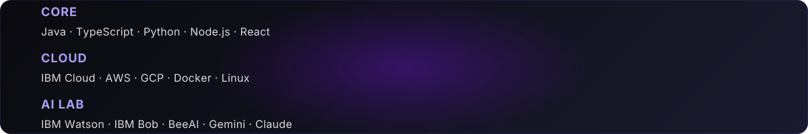

***

> ⚠️ **AI-Generated Disclaimer:** All information in this README was researched and written by an AI agent. It is automatically updated every day to keep data current. Content may not reflect real-time changes made outside of scheduled update cycles.

***

***

### Professional Journey

**Edgar Bruney** is an experienced engineer at **IBM's CIO Organization** in **Zapopan, Jalisco, Mexico**, specializing in translating research-grade AI into production systems. A GitHub member since **2013** with over 13 years of experience in the tech industry, he has built a distinguished career focused on cutting-edge technology implementation and open-source contribution.

Currently working at the intersection of **agentic AI development** and **cloud architecture**, Edgar designs and implements multi-agent pipelines using frameworks like **BeeAI**, **CrewAI**, and **LangGraph**. His work spans from concept to deployed REST APIs with async jobs and live SSE streaming, with emphasis on practical applications that solve real-world problems. He specializes in verify-and-retry orchestration loops and production-ready AI systems that bridge the gap between research and enterprise deployment, demonstrating a unique ability to transform research-grade AI into practical enterprise solutions.

Most recently, Edgar upgraded the **IBM Bob Shell Harness** (v1.0.2, released August 2026) to support **Bob Shell 2.x**, which introduced a new `run` subcommand CLI interface and a revised transcript format — keeping his flagship project at the cutting edge of IBM's agentic tooling ecosystem. He has also expanded his health-and-fitness data engineering work, publishing scripts for **Google Fit API**, **Huawei Health**, and **Strava analytics** (running performance, CrossFit sessions, and calorie tracking), and continues to deepen his quantum computing portfolio with a growing suite of specialised agents.

### Technical Expertise

Edgar holds multiple industry certifications:

* **IBM Generative & Agentic AI Expert Developer**
* **AWS Serverless Badge Holder**
* **Hybrid Cloud Microservices Architect**

His comprehensive technical stack includes:

* **AI/ML Frameworks:** BeeAI, CrewAI, LangGraph, AgentStack SDK, A2A protocol
* **Cloud Platforms:** IBM Cloud, AWS, multi-cloud architecture design and implementation
* **Quantum Computing:** Qiskit experiments and community contributions; active contributor to IBM's Qiskit Runtime (236⭐, 218 forks); expanding quantum-agent portfolio (quantum-lab-agent, quantum-computing-agent, quantum-developer-agent, quantum-status-agent)
* **Integration Technologies:** REST API design, Docker containerization, Slack integration (Socket Mode), Strava API, Google Fit API, Huawei Health API
* **Specializations:** Multi-agent pipeline design, verify-and-retry orchestration loops, async jobs with live SSE streaming, enterprise AI deployment, fitness data engineering

### Featured Projects

**[IBM Bob Shell Harness](https://github.com/BrUn3y/IBM_Bob_Harness)** (23⭐, 5 forks) — A Dockerized harness running IBM's Bob Shell headless in unrestricted mode, exposed via REST API with async jobs and live SSE streaming. Features Slack integration for autonomous AI operations with verify-and-retry orchestration loops. Now at **v1.0.2** with full Bob Shell 2.x compatibility (new `bob run` CLI, updated transcript format). This project showcases expertise in containerization, API development, and production-grade AI deployment, representing a bridge between enterprise AI tools and practical automation.

**[Strava Agent](https://github.com/BrUn3y/Strava_Agent)** (5⭐, 1 fork) — An advanced conversational AI system built with BeeAI framework and AgentStack SDK that analyzes athletic performance directly from the Strava API. Complemented by the newer **[strava-analytics](https://github.com/BrUn3y/strava-analytics)** repository — Python scripts for in-depth analysis of running performance, CrossFit sessions, and calorie tracking — this personal project drives Edgar's data-driven approach to fitness, targeting a sub-21 minute 5K.

**X Trends Agent** — A trend-analysis agent implemented across three different frameworks ([BeeAI](https://github.com/BrUn3y/x_trends_agent_BeeAI), [CrewAI](https://github.com/BrUn3y/x_trends_agent_CrewAI), [LangGraph](https://github.com/BrUn3y/x_trends_agent_LangGraph)), demonstrating framework-agnostic agent engineering capabilities and deep understanding of different AI architectures. This multi-framework approach showcases adaptability and comprehensive knowledge of the agentic AI ecosystem.

**Quantum Agent Suite** — A growing collection of quantum computing agents ([quantum-lab-agent](https://github.com/BrUn3y/quantum-lab-agent), [quantum-computing-agent](https://github.com/BrUn3y/quantum-computing-agent), [quantum-developer-agent](https://github.com/BrUn3y/quantum-developer-agent), [quantum-status-agent](https://github.com/BrUn3y/quantum-status-agent), all created August 2026) exploring the intersection of AI agents and quantum computing technologies, alongside ongoing contributions to the Qiskit ecosystem.

**Qiskit Contributions** — Active contributor to Qiskit/qiskit-ibm-runtime (236⭐, 218 forks) and documentation translation projects, supporting the global quantum computing community and making quantum computing more accessible worldwide through multilingual documentation efforts.

### Beyond Code

Edgar is actively engaged in the tech community with significant leadership and educational initiatives:

* **Co-organizing quantum computing meetups** in Guadalajara, with 60+ attendees at the inaugural session, fostering local quantum computing education and networking. This community leadership helps establish Guadalajara as an emerging hub for quantum computing in Latin America.
* **Writing on [Medium](https://medium.com/@brun3y)** about AI agents, athletic performance data, and cloud tooling, sharing practical insights from real-world implementations and providing valuable perspectives on applying AI to solve practical problems.
* **Open-source contributions** across 51 public repositories with 51 starred projects, demonstrating active participation in the developer community and commitment to collaborative development.
* **Community building** with 14 followers and 29 following on GitHub, maintaining connections across the global tech ecosystem and fostering knowledge exchange.

When stepping away from the screen, Edgar pursues his passion for **running and CrossFit** (actively training for a sub-21 minute 5K and tracking cross-training sessions with AI-powered analytics) and enjoys **heavy music**. His application of AI technology to personal fitness optimization reflects his commitment to applying technology to personal growth.

`BeeAI · CrewAI · LangGraph`  ·  `IBM Cloud`  ·  `Qiskit`  ·  `Running · CrossFit`  ·  `Heavy Music`

***

 

***

### Open Source

* **[IBM Bob Shell Harness](https://github.com/BrUn3y/IBM_Bob_Harness)** (23⭐, 5 forks) — Dockerized harness that runs IBM's Bob Shell headless in unrestricted mode and exposes it over a REST API with Slack integration for autonomous AI operations. Now at v1.0.2 with Bob Shell 2.x support.
* **[Strava Agent](https://github.com/BrUn3y/Strava_Agent)** (5⭐, 1 fork) — Advanced conversational AI system built with BeeAI framework and AgentStack SDK that analyzes athletic performance directly from the Strava API.
* **[Strava Analytics](https://github.com/BrUn3y/strava-analytics)** — Python scripts to analyze Strava activities: running performance, CrossFit sessions, and calorie tracking.
* **X Trends Agent** — Same trend-analysis agent, three frameworks: [BeeAI](https://github.com/BrUn3y/x_trends_agent_BeeAI) · [CrewAI](https://github.com/BrUn3y/x_trends_agent_CrewAI) · [LangGraph](https://github.com/BrUn3y/x_trends_agent_LangGraph).
* **Quantum Agent Suite** — [quantum-lab-agent](https://github.com/BrUn3y/quantum-lab-agent) · [quantum-computing-agent](https://github.com/BrUn3y/quantum-computing-agent) · [quantum-developer-agent](https://github.com/BrUn3y/quantum-developer-agent) · [quantum-status-agent](https://github.com/BrUn3y/quantum-status-agent) — exploring AI and quantum computing technologies.
* **Qiskit Contributions** — Active contributor to Qiskit/qiskit-ibm-runtime (236⭐, 218 forks) and documentation translation, supporting the quantum computing community.

***

### On Medium

I write on [Medium](https://medium.com/@brun3y) about AI agents, athletic performance data, and cloud tooling.

<table>
  <tr>
    <td>
      
    </td>
    <td>
      
    </td>
  </tr>
  <tr>
    <td>
      
    </td>
    <td>
      
    </td>
  </tr>
</table>

***

***

### 🎧 Now Playing on Spotify

***

### 🏆 Strava Personal Records

***

ℹ️ Profile information collected and updated by AI assistant on September 2, 2026

