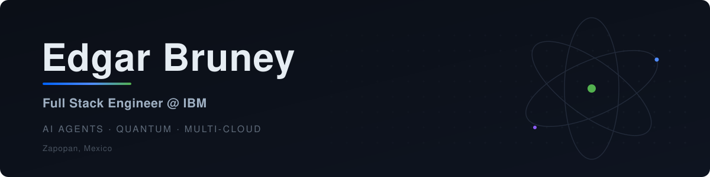

---

### Tech Stack

**Core** &nbsp;     

**Cloud** &nbsp;     

**AI Lab** &nbsp;    

---

### Who I Am

Meet **Edgar Bruney** — an engineer who joined GitHub in **2013** and never stopped shipping. Today I work inside **IBM's CIO Organization** in **Zapopan, Mexico**, translating research-grade AI into real production systems.

Right now I'm deep in **agentic AI development** — designing multi-agent pipelines with **BeeAI**, **CrewAI**, and **LangGraph** that go from concept to deployed REST APIs. I built a [personal running coach agent](https://medium.com/@brun3y/my-personal-ai-agent-for-strava-bdcb43d4fa3a) on top of the **Strava API** using **AgentStack SDK** that actually moved my 5K time toward **sub-21 minutes**, and I containerized **IBM Bob Shell** into a headless REST harness with Slack integration for autonomous operations. My work spans **A2A protocol** implementations and framework-agnostic agent engineering.

Beyond AI agents: **Qiskit** experiments, multi-cloud architecture, and co-organizing **quantum computing meetups** in Guadalajara (60+ attendees at our inaugural session). I hold certifications as an **IBM Generative & Agentic AI Expert Developer**, **AWS Serverless** badge holder, and **Hybrid Cloud Microservices Architect**. I actively contribute to open-source projects including Qiskit documentation translations, supporting the global quantum computing community.

When I step away from the screen, I run and listen to **heavy music**.

`BeeAI · CrewAI · LangGraph` &nbsp;·&nbsp; `IBM Cloud` &nbsp;·&nbsp; `Qiskit` &nbsp;·&nbsp; `Running` &nbsp;·&nbsp; `Heavy Music`

ℹ️ This bio was compiled from publicly available information across the internet and written with the help of AI.

---

 

---

### Open Source

- **[IBM Bob Shell Harness](https://github.com/BrUn3y/IBM_Bob_Harness)** — Dockerized harness that runs IBM's Bob Shell headless in unrestricted mode and exposes it over a REST API with Slack integration for autonomous AI operations.
- **[Strava Agent](https://github.com/BrUn3y/Strava_Agent)** (5⭐) — Advanced conversational AI system built with BeeAI framework and AgentStack SDK that analyzes athletic performance directly from the Strava API.
- **X Trends Agent** — Same trend-analysis agent, three frameworks: [BeeAI](https://github.com/BrUn3y/x_trends_agent_BeeAI) · [CrewAI](https://github.com/BrUn3y/x_trends_agent_CrewAI) · [LangGraph](https://github.com/BrUn3y/x_trends_agent_LangGraph).
- **Qiskit Translations** — Active contributor to Qiskit documentation translation, supporting the quantum computing community.

---

### On Medium

I write on [Medium](https://medium.com/@brun3y) about AI agents, athletic performance data, and cloud tooling.

<table>
  <tr>
    <td>
      
    </td>
    <td>
      
    </td>
  </tr>
  <tr>
    <td>
      
    </td>
    <td>
      
    </td>
  </tr>
</table>

---

### Stats

---

### Listening To

---

**Open to collaborating on AI agents, cloud, and quantum experiments.**

---

🤖 **Auto-updated by AI** on **2026-08-07**  
All information gathered from publicly available sources across the internet.

