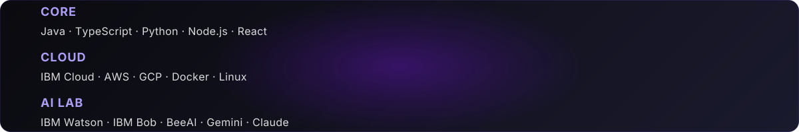
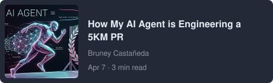
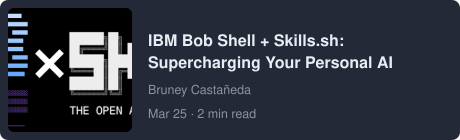
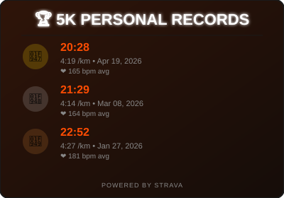
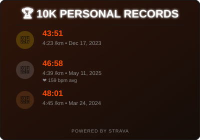
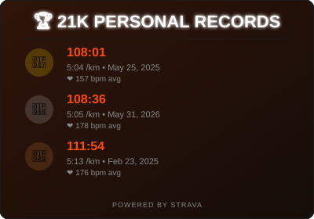
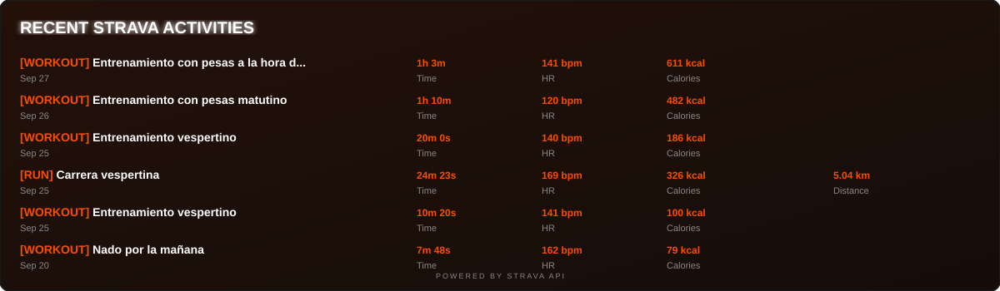

***

> ⚠️ **AI-Generated Disclaimer:** All information in this README was researched and written by an AI agent. It is automatically updated every day to keep data current. Content may not reflect real-time changes made outside of scheduled update cycles.

***

***

### Professional Journey

**Edgar Bruney Castañeda** is an experienced engineer at **IBM's CIO Organization** in **Zapopan, Jalisco, Mexico**, specializing in translating research-grade AI into production systems. A GitHub member since **2013** with over 13 years of experience in the tech industry, he has built a distinguished career focused on cutting-edge technology implementation and open-source contribution.

Currently working at the intersection of **agentic AI development** and **cloud architecture**, Edgar designs and implements multi-agent pipelines using frameworks like **BeeAI**, **CrewAI**, and **LangGraph**. His work spans from concept to deployed REST APIs with async jobs and live SSE streaming, with emphasis on practical applications that solve real-world problems. He specializes in verify-and-retry orchestration loops and production-ready AI systems that bridge the gap between research and enterprise deployment, demonstrating a unique ability to transform research-grade AI into practical enterprise solutions.

His most recent open-source work centers on the **Quantum Lab Agent System**: a five-agent A2A network — Developer, Status, Computing, and Experiment specialists — all orchestrated by a central Lab Agent and powered by **IBM Granite 4.2 8B** running locally via Ollama. The system features an Agent Stack Canvas integration for circuit visualization, live backend topology dashboards, and end-to-end QAOA Max-Cut experiments on real IBM Quantum hardware including `ibm_marrakesh`. Edgar is also a core organizer of **Quantum Guild GDL** (established August 17, 2026), a Guadalajara-based community co-organizing the **[Qiskit Fall Fest Guadalajara 2026](https://quantum-guild-gdl.github.io/qiskit_fall_fest_gdl/)** — a free, two-day community quantum computing festival (October 28–29, 2026, Mexico City time/CST) with both days streamed **online**. The festival site was iteratively refined throughout September: organizer **Ana Leal** was added on September 25; Open Graph and Twitter meta tags were improved on September 28; on September 29, a full English translation was completed, a two-track parallel schedule (*Round Table for Decision Makers* alongside the *IBM Quantum Platform* session) was added, Discord navigation and Luma checkout were integrated, and speakers **José Ramón Díaz Lara** and quantum expert **Salvador E. Venegas-Andraca** joined. On **September 30**, speakers **Adolfo Reynoso** and **Jorge Saúl Salas Villalobos** were added and the Day 1 schedule was updated to fully online. On **October 1, 2026**, **registration officially opened** — all "Get your ticket" buttons went live.

Edgar's open-source contributions span major generative programming, agent orchestration, and platform engineering. His **[PR #1676](https://github.com/generative-computing/mellea/pull/1676)** to **[generative-computing/mellea](https://github.com/generative-computing/mellea)** (1,819⭐, 162 forks) — implementing dynamic OpenAI adapter deregistration (`OpenAIBackend.remove_adapter()`) — was **merged on September 28, 2026**. Also on **September 28**, Edgar forked **[NASA's OpenMCT](https://github.com/nasa/openmct)** (13,152⭐, 1,490 forks) and created branch `mct6989` to fix stale tooltip path requests (issue #6989). On September 24, he forked **[strands-agents/harness-sdk](https://github.com/strands-agents/harness-sdk)** (8,661⭐, 1,323 forks) for multi-cloud agent harness management. On **September 22, 2026**, his **[PR #3930](https://github.com/heygen-com/hyperframes/pull/3930)** to **[heygen-com/hyperframes](https://github.com/heygen-com/hyperframes)** (56,791⭐, 5,098 forks) was **merged** into core, making IBM Bob Shell a first-class supported coding-agent runtime.

In addition, Edgar published **[TriForge](https://github.com/BrUn3y/triforge)** on **September 23, 2026** — a reusable project template transforming Codex, Claude Code, and IBM Bob Shell into an *auditable engineering council* where all three agents review independently in parallel before shipping code. On **September 29, 2026**, Edgar forked the **[Microsoft Quantum Development Kit (QDK)](https://github.com/microsoft/qdk)** (1,018⭐, 217 forks) — expanding his quantum computing contributions beyond IBM Qiskit to include Q# development, Microsoft's quantum resource estimator, and Quantum Katas.

As part of the **IBM Hacktoberfest** initiative, Edgar contributed to **[dam-agents/dam](https://github.com/dam-agents/dam)** (25⭐, 11 forks) — an open-source platform for running long-lived AI agents in isolated pods with runtime credential injection, scheduled triggers, and Slack-native access. On **October 1, 2026**, he submitted **[PR #4285](https://github.com/dam-agents/dam/pull/4285)** (*"fix(ui): keep dialog content through close animation"*) — fixing a UI bug where closing confirm/alert dialogs flashed different content before fading out, while simplifying the exit animation and adding regression test coverage; the PR is currently under review. On **October 2, 2026**, he submitted **[PR #4287](https://github.com/dam-agents/dam/pull/4287)** (*"fix(ui): keep active session when deleting another"*) — preventing React portal click-event bubbling that caused inactive-session deletions to inadvertently switch the active session, complete with regression coverage for session deletion workflows. **PR #4287 was merged on October 3, 2026**, making it Edgar's first contribution to be accepted into the DAM codebase.

### Technical Expertise

Edgar holds multiple industry certifications:

* **IBM Generative & Agentic AI Expert Developer**
* **AWS Serverless Badge Holder**
* **Hybrid Cloud Microservices Architect**

His comprehensive technical stack includes:

* **AI/ML Frameworks:** BeeAI, CrewAI, LangGraph, Mellea (generative programming), AgentStack SDK, Harness SDK, A2A protocol, IBM Granite 4.2 8B (Ollama)
* **Cloud Platforms:** IBM Cloud, AWS, multi-cloud architecture design and implementation
* **Quantum Computing:** Qiskit, QASM 2.0/3.0, QAOA, VQE, Grover, Shor, Deutsch-Jozsa, QFT algorithms; real-hardware execution on IBM Quantum; active contributor to Qiskit/qiskit-ibm-runtime (238⭐, 224 forks) and qiskit-addon-sqd (Sample-based Quantum Diagonalization, 101⭐, 44 forks); Agent Stack Canvas for circuit and topology visualization; hybrid quantum-classical multi-agent systems; Microsoft QDK (Q#, resource estimator, Quantum Katas, 1,018⭐, 217 forks)
* **Integration Technologies:** REST API design, Docker containerization, Slack integration (Socket Mode), Strava API, Google Fit API, Huawei Health API, CLI-Hub public catalog (CLI-Anything, 51,542⭐)
* **Specializations:** Multi-agent pipeline design with A2A protocol, verify-and-retry orchestration loops, async jobs with live SSE streaming, enterprise AI deployment, generative programming and backend adapter management (Mellea), HTML-to-video rendering for agents (hyperframes / HeyGen), Kubernetes agent sandboxing (DAM platform, 25⭐, 11 forks), multi-agent peer-review orchestration (TriForge), interactive architecture diagram generation (Archify), React/TypeScript UI contributions (dam-agents/dam), native TUI harness integration (Omnigent meta-harness, 10,524⭐), CLI catalog registration (HKUDS/CLI-Anything, 51,542⭐)

### Featured Projects

**[TriForge](https://github.com/BrUn3y/triforge)** — A reusable GitHub template published on September 23, 2026 that orchestrates Codex, Claude Code, and IBM Bob Shell as an *auditable engineering council*. All three agents consult in parallel, one implements, and the other two review independently — nothing ships without unanimous approval. The project ships with a Python `agent_loop` coordinator, animated communication demo, full test suite, and an [interactive Archify architecture diagram](https://brun3y.github.io/triforge/) on GitHub Pages. Every handoff is persisted in `live.log` and `transcript.jsonl` for complete auditability. Built with Python, `.bob/`, `.claude/`, and `.codex/` configuration layers side-by-side.

**[IBM Bob Shell Harness](https://github.com/BrUn3y/IBM_Bob_Harness)** (24⭐, 5 forks) — A Dockerized harness running IBM's Bob Shell headless in unrestricted mode, exposed via REST API with async jobs and live SSE streaming. Features Slack integration for autonomous AI operations with verify-and-retry orchestration loops. Released **v1.0.2** on August 27, 2026 with full Bob v2.x CLI support (`run` subcommand and `--mode` flag), followed by a September 7, 2026 update adding file-support improvements. The harness itself was actively used to merge pull requests and commit changes to the Qiskit Fall Fest Guadalajara site, demonstrating its real-world autonomous capabilities in production.

**[Mellea Contributions](https://github.com/generative-computing/mellea)** (1,819⭐, 162 forks) — On September 24, 2026, Edgar submitted **[PR #1676](https://github.com/generative-computing/mellea/pull/1676)** (*"fix: add OpenAI adapter deregistration"*) to `generative-computing/mellea`, introducing `OpenAIBackend.remove_adapter()` to enable dynamic adapter deregistration, cache invalidation, and qualified name recycling under concurrency locks. After Edgar addressed reviewer `@jakelorocco`'s feedback on September 25, the PR was **merged on September 28, 2026**, making the adapter deregistration feature part of the Mellea library's upstream codebase.

**[hyperframes](https://github.com/BrUn3y/hyperframes)** — Edgar's fork of the viral **[HeyGen hyperframes](https://github.com/heygen-com/hyperframes)** project (56,791⭐, 5,098 forks), a framework for writing HTML and rendering it as video — purpose-built for AI agents. On September 14, 2026, Edgar submitted **[PR #3930](https://github.com/heygen-com/hyperframes/pull/3930)** upstream to add IBM Bob runtime support to the HyperFrames CLI. The PR was approved and **merged on September 22, 2026** by maintainer `jrusso1020`, permanently integrating IBM Bob Shell into HyperFrames as a first-class supported coding-agent runtime.

**[Quantum Lab Agent System](https://github.com/BrUn3y/quantum_lab_agent)** — A complete five-agent multi-agent workspace for IBM Quantum, built entirely with the A2A protocol and IBM Granite 4.2 8B. The orchestrator (`quantum_lab_agent`, port 8000) coordinates four specialist agents: a [Quantum Developer Agent](https://github.com/BrUn3y/quantum-developer-agent) for code generation (Grover, Shor, Deutsch-Jozsa, QFT…), a [Quantum Status Agent](https://github.com/BrUn3y/quantum-status-agent) for real-time backend monitoring and chip topology Canvas visualization, a [Quantum Computing Agent](https://github.com/BrUn3y/quantum-computing-agent) for circuit execution on simulators and real IBM Quantum hardware, and the [Quantum Experiment Agent](https://github.com/BrUn3y/quantum-experiment-agent) for hybrid QAOA/VQE experiments (QAOA Max-Cut for 2–8 node graphs on `ibm_marrakesh`).

**[Strava Agent](https://github.com/BrUn3y/Strava_Agent)** (5⭐, 1 fork) — An advanced conversational AI system built with BeeAI framework and AgentStack SDK that analyzes athletic performance directly from the Strava API. Features full A2A protocol support, AgentStack Server RESTful endpoints, and five organized agent skills for multi-agent integration. Complemented by [strava-analytics](https://github.com/BrUn3y/strava-analytics), a Python toolkit for analyzing running performance, CrossFit sessions, and calorie tracking.

**X Trends Agent** — A trend-analysis agent implemented across three different frameworks ([BeeAI](https://github.com/BrUn3y/x_trends_agent_BeeAI), [CrewAI](https://github.com/BrUn3y/x_trends_agent_CrewAI), [LangGraph](https://github.com/BrUn3y/x_trends_agent_LangGraph)), demonstrating framework-agnostic agent engineering capabilities and deep understanding of different AI architectures.

**[NASA OpenMCT](https://github.com/BrUn3y/openmct)** — On September 28, 2026, Edgar forked the **[NASA OpenMCT](https://github.com/nasa/openmct)** project (13,152⭐, 1,490 forks) — NASA's web-based mission control framework powering space operations and data visualization — and created branch `mct6989` to contribute a fix for stale tooltip path requests (issue #6989). The patch invalidates pending asynchronous path lookups when the pointer leaves a tooltip target or its component unmounts, with regression test coverage for the search result race condition.

**[Microsoft QDK](https://github.com/BrUn3y/qdk)** — On **September 29, 2026**, Edgar forked the **[Microsoft Quantum Development Kit](https://github.com/microsoft/qdk)** (1,018⭐, 217 forks), extending his quantum computing work beyond IBM Qiskit into the Microsoft ecosystem. The fork provides direct access to Q# language development, the quantum resource estimator for pre-deployment cost analysis, and the full Quantum Katas learning library.

**[dam-agents/dam Contributions](https://github.com/dam-agents/dam)** (25⭐, 11 forks) — As part of **IBM Hacktoberfest**, Edgar made two UI bug-fix contributions to `dam-agents/dam` — an open platform for running long-lived AI agents in isolated pods with runtime credential injection and Slack-native access. **[PR #4285](https://github.com/dam-agents/dam/pull/4285)** (*October 1, 2026*) fixes confirm/alert dialogs flashing stale content during their close animation by retaining dialog state through the exit transition and simplifying it to a 100 ms fade, with full regression test coverage; it is currently under review. **[PR #4287](https://github.com/dam-agents/dam/pull/4287)** (*October 2, 2026*, **merged October 3, 2026**) fixes a React portal click-propagation bug where deleting an inactive session unintentionally switched the active session — resolved by stopping event bubbling at the session action-menu boundary. PR #4287 is Edgar's first merged contribution to the DAM platform.

**[HKUDS/CLI-Anything](https://github.com/HKUDS/CLI-Anything)** (51,542⭐, 4,690 forks) — On **October 2, 2026**, Edgar submitted **[PR #529](https://github.com/HKUDS/CLI-Anything/pull/529)** (*"feat(registry): add IBM Bob Shell to public catalog"*) to the CLI-Hub public catalog, registering IBM Bob Shell v2.0.5 as a discoverable and installable AI tool. The entry includes the official install script, Node.js 24+ requirements, and documentation links. An earlier PR #528 was superseded by this submission.

**[omnigent-ai/omnigent](https://github.com/omnigent-ai/omnigent)** (10,524⭐, 1,685 forks) — Edgar forked the Omnigent AI agent meta-harness on **October 2, 2026** and submitted **[PR #8902](https://github.com/omnigent-ai/omnigent/pull/8902)** (*"feat(harness): add IBM Bob native TUI integration"*), implementing `bob-native`: a terminal-first native harness that launches `bob chat` in a runner-owned tmux pane and mirrors Omnigent web-composer messages into Bob's input. The implementation follows the same registry seam as Kiro, Goose, and Qwen, with full provider rows, capability entries, readiness/install metadata, and dialog fail-closed handling for Bob's folder-trust and tool-approval prompts. The PR is currently open and under review.

**Qiskit/qiskit-ibm-runtime Contributions** (238⭐, 222 forks) — On **October 2, 2026**, Edgar submitted two new PRs: **[PR #3425](https://github.com/Qiskit/qiskit-ibm-runtime/pull/3425)** (*"Reject nan angles in rzz validation"*) hardens `rzz` gate angle validation to reject `nan`/non-finite values with a proper `IBMInputValueError`; and **[PR #3426](https://github.com/Qiskit/qiskit-ibm-runtime/pull/3426)** (*"Expose timestamps in Session/Batch details()"*) surfaces the optional `timestamps` state-transition list from `GET /v1/sessions/:id` in the dictionaries returned by `Session.details()` and `Batch.details()`. Both PRs are currently open and awaiting review.

**Qiskit & Quantum Ecosystem** — Active contributor to Qiskit/qiskit-ibm-runtime (238⭐, 222 forks) and **qiskit-addon-sqd** (Sample-based Quantum Diagonalization, 101⭐, 44 forks), alongside the **[Microsoft QDK](https://github.com/microsoft/qdk)** (1,018⭐, 217 forks) — spanning Q#, the quantum resource estimator, and Quantum Katas.

### Beyond Code

Edgar is actively engaged in the tech community with significant leadership and educational initiatives:

* **PR #4287 merged into dam-agents/dam** — on **October 3, 2026**, **[PR #4287](https://github.com/dam-agents/dam/pull/4287)** (*"fix(ui): keep active session when deleting another"*) was *merged* into the DAM platform — Edgar's first accepted contribution to the project. The fix resolves a React portal click-propagation bug that caused inactive-session deletions to inadvertently switch the active session. **PR #4285** (*"fix(ui): keep dialog content through close animation"*, October 1) remains open and under review.
* **IBM Hacktoberfest — Contributing to dam-agents/dam** — Edgar made two UI bug-fix contributions to **[dam-agents/dam](https://github.com/dam-agents/dam)** (25⭐, 11 forks): **[PR #4285](https://github.com/dam-agents/dam/pull/4285)** (*October 1*) fixes dialog close-animation content flash and is under review, and **[PR #4287](https://github.com/dam-agents/dam/pull/4287)** (*October 2*, **merged October 3**) fixes React portal click-propagation that incorrectly switched the active session during inactive-session deletion. Both PRs include full regression test coverage and follow DAM's Conventional Commit and DCO sign-off standards.
* **Qiskit/qiskit-ibm-runtime PRs #3425 & #3426** — on **October 2, 2026**, Edgar submitted two Qiskit pull requests: **[PR #3425](https://github.com/Qiskit/qiskit-ibm-runtime/pull/3425)** hardens `rzz` gate validation against `nan` angles, and **[PR #3426](https://github.com/Qiskit/qiskit-ibm-runtime/pull/3426)** exposes session state-transition timestamps in `Session.details()` and `Batch.details()` — both with full test coverage and currently open awaiting review. The repository now has 238⭐ and 224 forks.
* **IBM Bob Shell now in Omnigent** — on **October 2, 2026**, Edgar forked **[omnigent-ai/omnigent](https://github.com/omnigent-ai/omnigent)** (10,524⭐, 1,685 forks) — the AI meta-harness orchestrating Claude Code, Codex, and Cursor — and submitted **[PR #8902](https://github.com/omnigent-ai/omnigent/pull/8902)** (*"feat(harness): add IBM Bob native TUI integration"*), wiring `bob-native` as a first-class terminal harness alongside Kiro, Goose, and Qwen in Omnigent's registry. The PR is currently open and under review.
* **IBM Bob Shell registered in CLI-Hub** — on **October 2, 2026**, Edgar submitted **[PR #529](https://github.com/HKUDS/CLI-Anything/pull/529)** to **[HKUDS/CLI-Anything](https://github.com/HKUDS/CLI-Anything)** (51,542⭐, 4,690 forks) to add IBM Bob Shell v2.0.5 to the public CLI-Hub catalog as a discoverable, installable AI tool. The PR is currently open and under review.
* **Qiskit Fall Fest GDL registration opened** — on **October 1, 2026**, the **[Qiskit Fall Fest Guadalajara 2026](https://quantum-guild-gdl.github.io/qiskit_fall_fest_gdl/)** officially opened registration: all "Get your ticket" Luma checkout buttons went live. On **September 30**, Edgar added two new speakers — **Adolfo Reynoso** and **Jorge Saúl Salas Villalobos** — and updated the Day 1 schedule to fully online (removing earlier in-person and hackathon references).
* **Forked Microsoft QDK** — on **September 29, 2026**, Edgar forked the **[Microsoft Quantum Development Kit](https://github.com/microsoft/qdk)** (1,018⭐, 217 forks), expanding his quantum computing contributions from IBM Qiskit into the Microsoft ecosystem — covering Q# language development, quantum resource estimation, and Quantum Katas.
* **Overhauled Qiskit Fall Fest GDL website** — on **September 29, 2026**, Edgar performed a major update to the **[Qiskit Fall Fest Guadalajara 2026](https://quantum-guild-gdl.github.io/qiskit_fall_fest_gdl/)** site: fully translated to English, revamped the schedule with a two-track parallel session (*Round Table for Decision Makers* alongside the *IBM Quantum Platform* workshop), added Luma checkout scripts for Tier 1 and Tier 2 registration, integrated a Discord navigation button, and added two new speakers — **José Ramón Díaz Lara** and quantum computing expert **Salvador E. Venegas-Andraca** (assigned to the Round Table). All speaker cards were sorted alphabetically.
* **Merged into Mellea** — **[PR #1676](https://github.com/generative-computing/mellea/pull/1676)** to **[Mellea](https://github.com/generative-computing/mellea)** (1,819⭐, 162 forks) was **merged on September 28, 2026**, permanently adding `OpenAIBackend.remove_adapter()` for dynamic adapter deregistration to the generative computing library's upstream codebase.
* **Contributing to NASA OpenMCT** — on **September 28, 2026**, Edgar forked **[NASA's OpenMCT](https://github.com/nasa/openmct)** (13,152⭐, 1,490 forks) — the web-based mission control framework used in NASA space operations — and submitted a fix for stale tooltip path request handling (issue #6989), adding invalidation of pending asynchronous path lookups and regression test coverage for search result race conditions.
* **Co-organizing Quantum Guild GDL** — founded August 17, 2026, the guild drives the **[Qiskit Fall Fest Guadalajara 2026](https://quantum-guild-gdl.github.io/qiskit_fall_fest_gdl/)**: a free, community-run quantum computing festival held **October 28–29, 2026** (Mexico City time/CST), both days streamed **online**. Registration is now **open**. Confirmed speakers include **Claudia Zendejas Morales** (Physicist, Grad Student @KU, Coordinator @QWorld, Qiskit Advocate), **Eva Nayeli Hernández Pulido** (IBM GreenStar DevOps & App Support, Quantum enthusiast), **Jesús Rolón** (Software Development Engineer at IBM), **Yra Cano** (Senior Software Developer at IBM), **Cuauhtemoc Salvador**, **José Ramón Díaz Lara**, **Salvador E. Venegas-Andraca**, **Adolfo Reynoso**, and **Jorge Saúl Salas Villalobos**. Organizers alongside Edgar are Andrés Alejandre, Barbara Baena, Eva Nayeli Hernández Pulido, Juan Miguel Ávila Sánchez, Kassandra Delfín, Tanya Franco, and **Ana Leal**.
* **Published TriForge** — on **September 23, 2026**, Edgar launched **[TriForge](https://github.com/BrUn3y/triforge)**, a first-of-its-kind open-source template that runs Codex, Claude Code, and IBM Bob Shell as an auditable, equal-peer engineering council with an [interactive architecture diagram](https://brun3y.github.io/triforge/) powered by **[Archify](https://github.com/tt-a1i/archify)** on GitHub Pages.
* **Merged into HyperFrames** — **[PR #3930](https://github.com/heygen-com/hyperframes/pull/3930)** to `heygen-com/hyperframes` (56,791⭐, 5,098 forks) was **merged on September 22, 2026**, permanently adding IBM Bob Shell as a supported coding-agent runtime in one of the most-starred open-source agent frameworks on GitHub.
* **Agent Infrastructure & Sandboxing** — active exploration of Kubernetes-native agent execution via **[dam-agents/dam](https://github.com/dam-agents/dam)** (25⭐, 11 forks) and multi-cloud agent harnesses with **[strands-agents/harness-sdk](https://github.com/strands-agents/harness-sdk)** (8,661⭐, 1,323 forks).
* **Writing on [Medium](https://medium.com/@brun3y)** about AI agents, athletic performance data, and cloud tooling, sharing practical insights from real-world implementations.
* **Open-source contributions** across 62 public repositories on GitHub, demonstrating continuous participation in the developer community and collaborative open-source engineering.
* **Community building** on GitHub with 17 followers and 28 following, maintaining connections across the global tech ecosystem and fostering knowledge exchange.

When stepping away from the screen, Edgar pursues his passion for **running** (actively training for a sub-21 minute 5K, tracking and analyzing every session with Python and AI tools) and enjoys **heavy music**. His application of AI technology to personal fitness optimization reflects his commitment to applying technology to personal growth.

`BeeAI · CrewAI · LangGraph`  ·  `IBM Cloud`  ·  `Qiskit`  ·  `Running`  ·  `Heavy Music`

***

 

***

### Open Source

* **[IBM Bob Shell Harness](https://github.com/BrUn3y/IBM_Bob_Harness)** (24⭐, 5 forks) — Dockerized harness that runs IBM's Bob Shell headless in unrestricted mode and exposes it over a REST API with Slack integration for autonomous AI operations.
* **[Strava Agent](https://github.com/BrUn3y/Strava_Agent)** (5⭐) — Advanced conversational AI system built with BeeAI framework and AgentStack SDK that analyzes athletic performance directly from the Strava API.
* **X Trends Agent** — Same trend-analysis agent, three frameworks: [BeeAI](https://github.com/BrUn3y/x_trends_agent_BeeAI) · [CrewAI](https://github.com/BrUn3y/x_trends_agent_CrewAI) · [LangGraph](https://github.com/BrUn3y/x_trends_agent_LangGraph).
* **[Quantum Lab Agent](https://github.com/BrUn3y/quantum_lab_agent)** / **[Quantum Experiment Agent](https://github.com/BrUn3y/quantum-experiment-agent)** — Quantum computing agents exploring AI and quantum circuits, including a hybrid agent powered by IBM Granite and AgentStack.
* **[hyperframes](https://github.com/BrUn3y/hyperframes)** — HTML-to-video renderer built for AI agents.
* **[strava-analytics](https://github.com/BrUn3y/strava-analytics)** — Python scripts to analyze running performance, CrossFit sessions, and calorie tracking from Strava.
* **Qiskit Contributions** — Active contributor to Qiskit/qiskit-ibm-runtime (238⭐, 224 forks) and qiskit-addon-sqd (101⭐, 44 forks), supporting the quantum computing community.

***

### On Medium

I write on [Medium](https://medium.com/@brun3y) about AI agents, athletic performance data, and cloud tooling.

<table>
  <tr>
    <td>
      
    </td>
    <td>
      
    </td>
  </tr>
  <tr>
    <td>
      
    </td>
    <td>
      
    </td>
  </tr>
</table>

***

***

### 🎧 Now Playing on Spotify

***

### 🏆 Strava Personal Records

***

ℹ️ Profile information collected and updated by AI assistant on October 6, 2026

