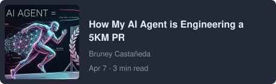
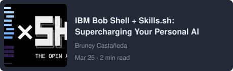
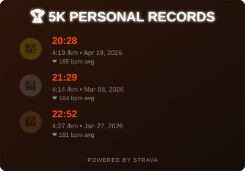
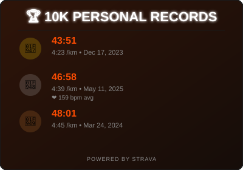
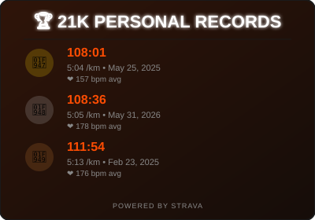
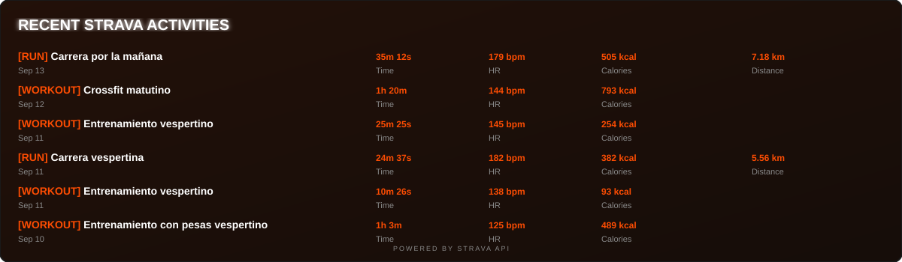

```aura width=1200 height=280
<div style={{
  width: '100%', height: '100%', background: 'linear-gradient(135deg, #0a0a0f 0%, #1a1a2e 100%)',
  display: 'flex', alignItems: 'center', fontFamily: 'Inter',
  position: 'relative', overflow: 'hidden', borderRadius: 16,
  border: '1px solid rgba(110,80,220,0.18)'
}}>

  <style>{`
      @keyframes float-slow {
        0%, 100% { transform: translateY(0px); opacity: 0.8; }
        50% { transform: translateY(-20px); opacity: 1.2; }
      }
      @keyframes float-medium {
        0%, 100% { transform: translateX(0px); opacity: 0.7; }
        50% { transform: translateX(-30px); opacity: 1.1; }
      }
      @keyframes pulse {
        0%, 100% { transform: scale(1); opacity: 0.6; }
        50% { transform: scale(1.2); opacity: 0.9; }
      }
      #glow-1 { animation: float-slow 8s ease-in-out infinite; }
      #glow-2 { animation: float-medium 12s ease-in-out infinite; }
      #glow-3 { animation: pulse 6s ease-in-out infinite; }
    `}</style>

  <svg width="1200" height="280" style={{ position: 'absolute', top: 0, left: 0 }}>
    <defs>
      <radialGradient id="g1" cx="50%" cy="50%" r="50%">
        <stop offset="0%" stopColor="rgba(110,20,210,0.5)" />
        <stop offset="70%" stopColor="rgba(90,15,180,0)" />
      </radialGradient>
      <radialGradient id="g2" cx="50%" cy="50%" r="50%">
        <stop offset="0%" stopColor="rgba(40,60,255,0.4)" />
        <stop offset="70%" stopColor="rgba(30,50,200,0)" />
      </radialGradient>
      <radialGradient id="g3" cx="50%" cy="50%" r="50%">
        <stop offset="0%" stopColor="rgba(0,190,230,0.3)" />
        <stop offset="70%" stopColor="rgba(0,190,230,0)" />
      </radialGradient>
    </defs>

    <ellipse id="glow-1" cx="200" cy="140" rx="300" ry="200" fill="url(#g1)" />
    <ellipse id="glow-2" cx="600" cy="140" rx="250" ry="180" fill="url(#g2)" />
    <ellipse id="glow-3" cx="1000" cy="140" rx="200" ry="150" fill="url(#g3)" />
  </svg>

  <div style={{ display:'flex', flexDirection:'column', marginLeft:60, gap:12, zIndex: 10, width: '100%' }}>
    <div style={{ display:'flex', fontSize:56, fontWeight:900, color:'#ffffff', letterSpacing:'-2px', lineHeight:1 }}>
      Edgar Bruney
    </div>
    <div style={{ display:'flex', fontSize:22, color:'rgba(180,165,255,0.9)', fontWeight:500, letterSpacing:'0.5px' }}>
      Agentic AI Engineer · Cloud Architect · Quantum Explorer
    </div>
    <div style={{ display:'flex', gap:12, marginTop:8, flexWrap: 'wrap' }}>
      {[
        'BeeAI', 'CrewAI', 'LangGraph', 'IBM Cloud', 'Qiskit', 'Docker'
      ].map(function(tag, i) {
        return (
          <div key={tag + '-' + i} style={{
            display:'flex', padding:'6px 16px', borderRadius:20,
            background:'rgba(80,40,220,0.2)', border:'1px solid rgba(100,70,240,0.4)',
            color:'rgba(205,195,255,0.95)', fontSize:14, fontWeight:700,
          }}>{tag}</div>
        );
      })}
    </div>
  </div>
</div>
```


---

### Tech Stack

<div>

**Core** &nbsp;     

**Cloud** &nbsp;     

**AI Lab** &nbsp;    

</div>

---

### Professional Journey

**Edgar Bruney** is an experienced engineer at **IBM's CIO Organization** in **Zapopan, Jalisco, Mexico**, specializing in translating research-grade AI into production systems. A GitHub member since **2013** with over 13 years of experience in the tech industry, he has built a distinguished career focused on cutting-edge technology implementation and open-source contribution.

Currently working at the intersection of **agentic AI development** and **cloud architecture**, Edgar designs and implements multi-agent pipelines using frameworks like **BeeAI**, **CrewAI**, and **LangGraph**. His work spans from concept to deployed REST APIs with async jobs and live SSE streaming, with emphasis on practical applications that solve real-world problems. He specializes in verify-and-retry orchestration loops and production-ready AI systems that bridge the gap between research and enterprise deployment, demonstrating a unique ability to transform research-grade AI into practical enterprise solutions.

### Technical Expertise

Edgar holds multiple industry certifications:
- **IBM Generative & Agentic AI Expert Developer**
- **AWS Serverless Badge Holder**
- **Hybrid Cloud Microservices Architect**

His comprehensive technical stack includes:
- **AI/ML Frameworks:** BeeAI, CrewAI, LangGraph, AgentStack SDK, A2A protocol
- **Cloud Platforms:** IBM Cloud, AWS, multi-cloud architecture design and implementation
- **Quantum Computing:** Qiskit experiments and community contributions, active contributor to IBM's Qiskit Runtime (235⭐, 218 forks)
- **Integration Technologies:** REST API design, Docker containerization, Slack integration (Socket Mode), Strava API, Google Fit API
- **Specializations:** Multi-agent pipeline design, verify-and-retry orchestration loops, async jobs with live SSE streaming, enterprise AI deployment

### Featured Projects

**[IBM Bob Shell Harness](https://github.com/BrUn3y/IBM_Bob_Harness)** (21⭐, 5 forks) — A Dockerized harness running IBM's Bob Shell headless in unrestricted mode, exposed via REST API with async jobs and live SSE streaming. Features Slack integration for autonomous AI operations with verify-and-retry orchestration loops. This project showcases expertise in containerization, API development, and production-grade AI deployment, representing a bridge between enterprise AI tools and practical automation.

**[Strava Agent](https://github.com/BrUn3y/Strava_Agent)** (5⭐, 1 fork) — An advanced conversational AI system built with BeeAI framework and AgentStack SDK that analyzes athletic performance directly from the Strava API. This personal project helped improve his 5K running time toward sub-21 minutes, demonstrating the practical application of AI in personal fitness optimization and data-driven athletic training.

**X Trends Agent** — A trend-analysis agent implemented across three different frameworks ([BeeAI](https://github.com/BrUn3y/x_trends_agent_BeeAI), [CrewAI](https://github.com/BrUn3y/x_trends_agent_CrewAI), [LangGraph](https://github.com/BrUn3y/x_trends_agent_LangGraph)), demonstrating framework-agnostic agent engineering capabilities and deep understanding of different AI architectures. This multi-framework approach showcases adaptability and comprehensive knowledge of the agentic AI ecosystem.

**[Quantum Lab Agent](https://github.com/BrUn3y/quantum_lab_agent)** — Quantum computing-related project exploring the intersection of AI agents and quantum computing technologies, pushing the boundaries at the cutting edge of both AI and quantum computing fields.

**Qiskit Contributions** — Active contributor to Qiskit/qiskit-ibm-runtime (235⭐, 218 forks) and documentation translation projects, supporting the global quantum computing community and making quantum computing more accessible worldwide through multilingual documentation efforts.

### Beyond Code

Edgar is actively engaged in the tech community with significant leadership and educational initiatives:
- **Co-organizing quantum computing meetups** in Guadalajara, with 60+ attendees at the inaugural session, fostering local quantum computing education and networking. This community leadership helps establish Guadalajara as an emerging hub for quantum computing in Latin America.
- **Writing on [Medium](https://medium.com/@brun3y)** about AI agents, athletic performance data, and cloud tooling, sharing practical insights from real-world implementations and providing valuable perspectives on applying AI to solve practical problems.
- **Open-source contributions** across 50 repositories with 47 starred projects, demonstrating active participation in the developer community and commitment to collaborative development.
- **Community building** with 12 followers and 28 following on GitHub, maintaining connections across the global tech ecosystem and fostering knowledge exchange.

When stepping away from the screen, Edgar pursues his passion for **running** (actively training for a sub-21 minute 5K using a data-driven AI approach) and enjoys **heavy music**. His application of AI technology to personal fitness optimization reflects his commitment to applying technology to personal growth.

`BeeAI · CrewAI · LangGraph` &nbsp;·&nbsp; `IBM Cloud` &nbsp;·&nbsp; `Qiskit` &nbsp;·&nbsp; `Running` &nbsp;·&nbsp; `Heavy Music`

---

<div align="center">


<br clear="right" />

</div>

---

### Open Source

- **[IBM Bob Shell Harness](https://github.com/BrUn3y/IBM_Bob_Harness)** (21⭐, 5 forks) — Dockerized harness that runs IBM's Bob Shell headless in unrestricted mode and exposes it over a REST API with Slack integration for autonomous AI operations.
- **[Strava Agent](https://github.com/BrUn3y/Strava_Agent)** (5⭐) — Advanced conversational AI system built with BeeAI framework and AgentStack SDK that analyzes athletic performance directly from the Strava API.
- **X Trends Agent** — Same trend-analysis agent, three frameworks: [BeeAI](https://github.com/BrUn3y/x_trends_agent_BeeAI) · [CrewAI](https://github.com/BrUn3y/x_trends_agent_CrewAI) · [LangGraph](https://github.com/BrUn3y/x_trends_agent_LangGraph).
- **[Quantum Lab Agent](https://github.com/BrUn3y/quantum_lab_agent)** — Quantum computing-related project exploring AI and quantum computing technologies.
- **Qiskit Contributions** — Active contributor to Qiskit/qiskit-ibm-runtime (235⭐, 218 forks) and documentation translation, supporting the quantum computing community.

---

### On Medium

I write on [Medium](https://medium.com/@brun3y) about AI agents, athletic performance data, and cloud tooling.

<table>
  <tr>
    <td>
      <a href="https://medium.com/@brun3y/how-my-ai-agent-is-engineering-a-5km-pr-a2e9966869f4">
        
      </a>
    </td>
    <td>
      <a href="https://medium.com/@brun3y/ibm-bob-shell-skills-sh-supercharging-your-personal-ai-d074dbd5ec7c">
        
      </a>
    </td>
  </tr>
  <tr>
    <td>
      <a href="https://medium.com/@brun3y/i-finally-got-positive-results-following-my-strava-ai-agent-76ab080d8808">
        
      </a>
    </td>
    <td>
      <a href="https://medium.com/@brun3y/my-personal-ai-agent-for-strava-bdcb43d4fa3a">
        
      </a>
    </td>
  </tr>
</table>

---


---

### 🎧 Now Playing on Spotify

<div align="center">

[](https://github.com/kittinan/spotify-github-profile)

</div>

---

### 🏆 Strava Personal Records

<div align="center">





</div>



---

### ⚛️ IBM Quantum - Última Ejecución

<div align="center">


</div>

---

<div align="center">
<sub>ℹ️ Profile information collected and updated by AI assistant on August 14, 2026</sub>
</div>
